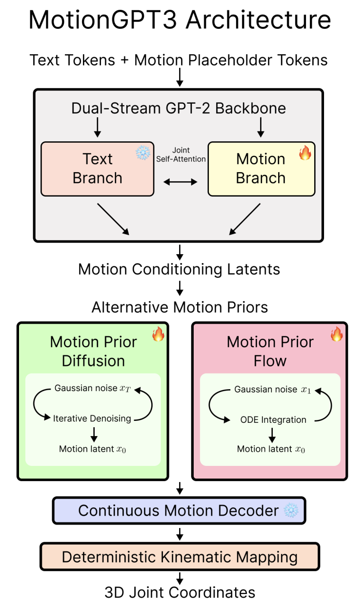
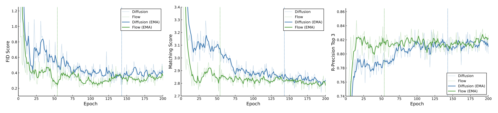
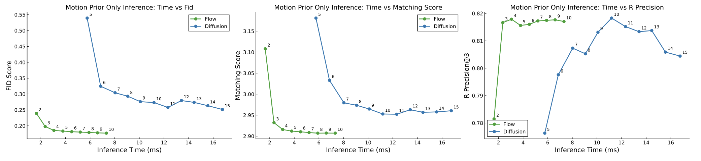

# From Diffusion To Flow: Efficient Motion Generation In MotionGPT3

This repository contains official code for the paper [From Diffusion To Flow: Efficient Motion Generation In MotionGPT3](https://openreview.net/forum?id=EuuNOyt282) (ReALM-GEN Workshop ICLR 2026) by [Jaymin Ban](https://scholar.google.com/citations?user=ZjGC0RYAAAAJ&hl=en), [JiHong Jeon](https://scholar.google.com/citations?user=dCNBZzUAAAAJ&hl=en&oi=sra) and [SangYeop Jeong](https://scholar.google.com/citations?user=axhPQT8AAAAJ&hl=en&oi=ao).


## Summary
Recently, flow-based approaches have shown competitive results in generative modeling for image and audio generation compared to diffusion methods. In this work, we conduct an isolated comparison to see if the known advantages of flow methodology extend to the motion generation domain.

We found that by replacing MotionGPT3's diffusion head with a rectified flow approach, we were able to further improve evaluation metrics while reducing both the required training epochs and the number of inference steps for motion generation.

## Architecture Diagram
<p align="center">
  
</p>

## Result Table 
| Methods | R@1↑ | R@2↑ | R@3↑ | FID↓ | MMDist↓ | Diversity↑ | MModality↑ |
|---|---|---|---|---|---|---|---|
| Real | 0.511 | 0.703 | 0.797 | 0.002 | 2.974 | 9.503 | – |
| T2M-GPT (Zhang et al., 2023) | 0.491 | 0.680 | 0.775 | 0.116 | 3.118 | **9.761** | 1.856 |
| DiverseMotion (Lou et al., 2023) | 0.515 | 0.706 | 0.802 | 0.072 | 2.941 | 9.683 | 1.869 |
| MoMask (Guo et al., 2023) | 0.521 | 0.713 | 0.807 | **0.045** | 2.958 | 9.620 | 1.241 |
| MotionGPT (Jiang et al., 2023) | 0.492 | 0.681 | 0.733 | 0.232 | 3.096 | 9.528 | 2.00 |
| TM2T (Guo et al., 2022b) | 0.424 | 0.618 | 0.729 | 1.501 | 3.467 | 8.589 | **2.424** |
| MotionGPT3 (Reported) | 0.533 | 0.731 | 0.826 | 0.239 | **2.797** | 9.688 | 1.560 |
| **MotionGPT3 (Diffusion, ep. 142)** | 0.520 | 0.716 | 0.807 | 0.240 | 2.918 | 9.479 | 2.277 |
| **MotionGPT3 (Flow, ep. 54)** | **0.544** | **0.740** | **0.828** | 0.192 | 2.837 | 9.340 | 2.366 |

> Comparison of text-to-motion generation methods on HumanML3D. Arrows indicate
whether higher (↑) or lower (↓) values are better. Real denotes statistics computed from groundtruth motion data. Bold values indicate the best performance for each metric.

## Training Curves


## Inference Step Comparison



## Setup and Download

Setup and download steps follow the [MotionGPT3 repository](https://github.com/OpenMotionLab/MotionGPT3) with minor dependency updates to match a single GPU (RTX 5090) environment.

Clone this repository.

Install [uv](https://docs.astral.sh/uv/), then:
```bash
uv venv .venv --python 3.11 && source .venv/bin/activate
uv pip install -r requirements.txt
python -m spacy download en_core_web_sm
```


Run the script to download dependencies materials:

```
bash prepare/download_smpl_model.sh
bash prepare/prepare_gpt2.sh
```

For Text to Motion Evaluation

```
bash prepare/download_t2m_evaluators.sh
```

For pre-trained MotionVAE:

```
bash prepare/download_mld_pretrained_models.sh
```

Then run following script to process checkpoints:
```
python -m scripts.gen_mot_gpt
```

### 3. Pre-trained model

Run the script to download the pre-trained model

```
bash prepare/download_pretrained_motiongpt3_model.sh
```

### 4. (Optional) Download manually

Visit [the Hugging Face](https://huggingface.co/OpenMotionLab/motiongpt3) to download the pretrained models.

## Training

1. Set up the text-to-motion dataset following the [HumanML3D](https://github.com/EricGuo5513/HumanML3D) instructions.

2. Copy the instruction data from `prepare/instructions` into the HumanML3D dataset folder.

3. Update the dataset and output paths in the following config files:

   - `configs/MoT_vae_stage3.yaml`
   - `configs/MoT_vae_stage2_instruct.yaml`
   - `configs/MoT_vae_stage2_all-flow.yaml`
   - `configs/MoT_vae_stage1_t2m-flow.yaml`
   - `configs/MoT_vae_stage2_all-diffusion.yaml`
   - `configs/MoT_vae_stage1_t2m-diffusion.yaml`
   - `configs/assets.yaml`

   And the training scripts:

   - `run_stage1_training-diffusion.sh`
   - `run_stage1_training-flow.sh`

4. Run training:
```bash
# Diffusion baseline
./run_stage1_training-diffusion.sh

# Rectified flow (ours)
./run_stage1_training-flow.sh
```